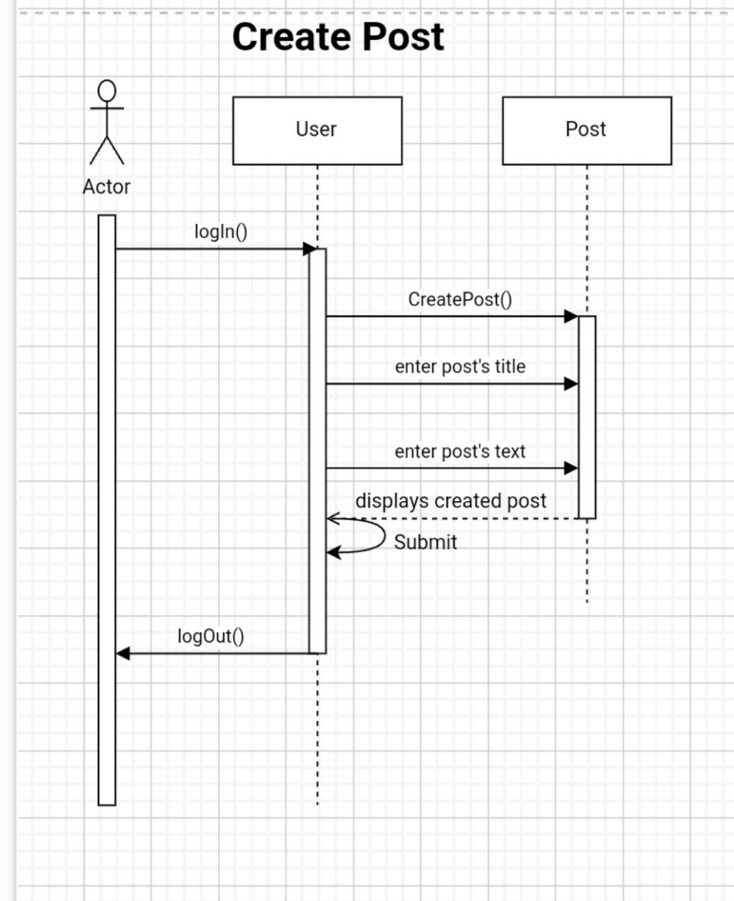
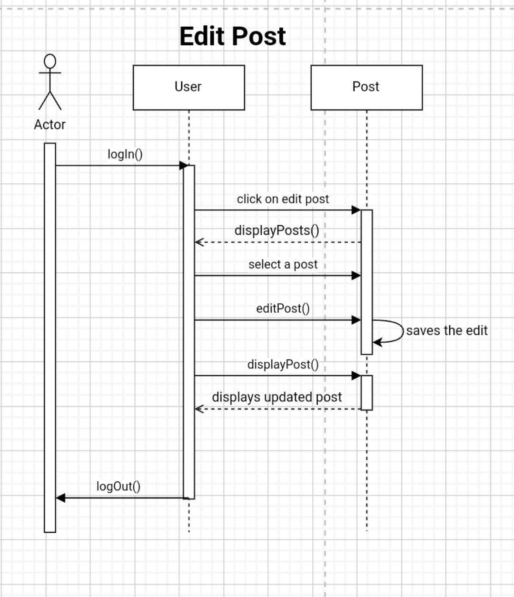
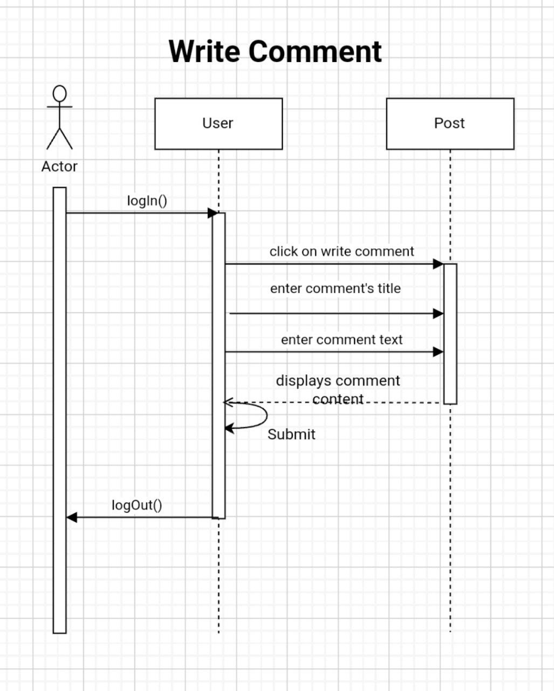
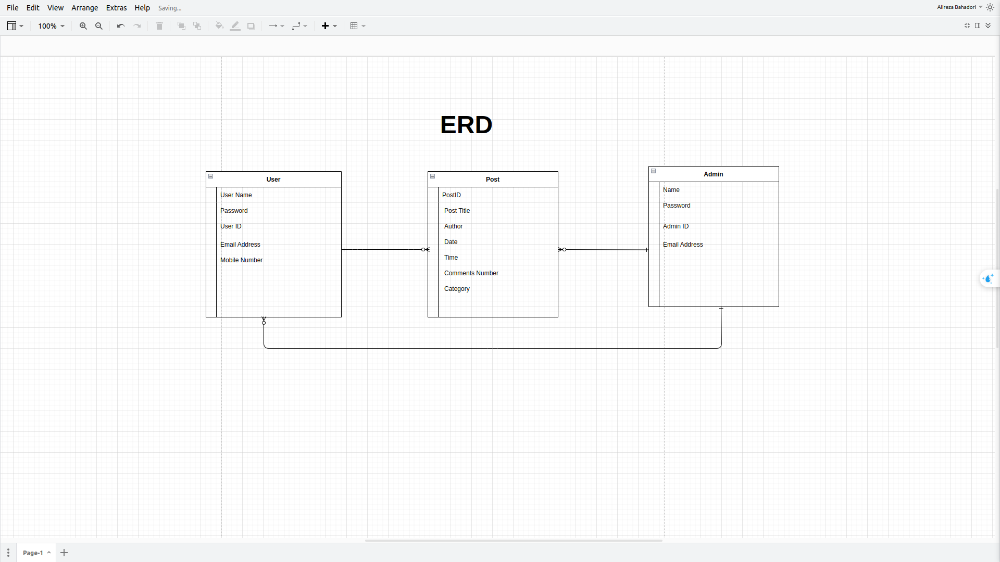

# Uni-Project
#### The final project of the undergraduate degree of the university
<hr>


## How to run Locally?

### Setting up python environment

```bash
python3 -m venv .venv
source .venv/bin/activate
```

### Installing dependencies

```bash
pip install -r requirements.txt
```

### Migration the project

```bash
python manage.py migrate
```
### Running the project

```bash
python manage.py runserver
# running project in http://localhost:8000
```
# Diagrams
## Sequence Diagrams
### Create Post




### Edit Post



### Write Comment



## Activity Diagram


## Entity Relation Diagram




