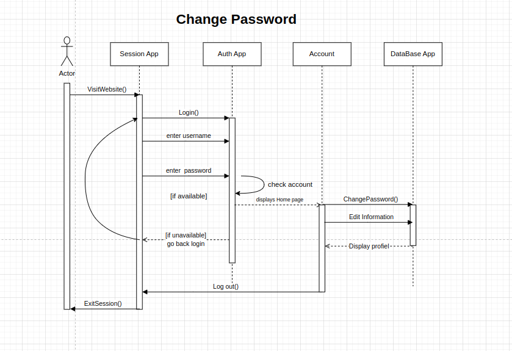
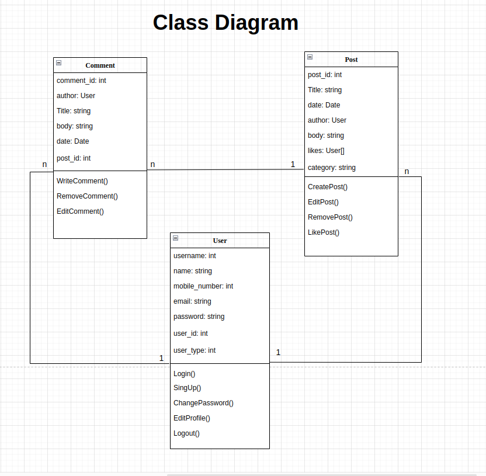

# Uni-Project
#### The final project of the undergraduate degree of the university
<hr>


## How to run Locally?

### Setting up python environment

```bash
python3 -m venv .venv
source .venv/bin/activate
```

### Installing dependencies

```bash
pip install -r requirements.txt
```

### Migration the project

```bash
python manage.py migrate
```
### Running the project

```bash
python manage.py runserver
# running project in http://localhost:8000
```


# Use Case

- [Use-Cases](./presentation/Use-Case/Report.pdf)

# Diagrams
## Sequence Diagrams

### SignUp


### Login


### Create Post


### Edit Post


### Write Comment


### Like Post


### Remove Post


### Edit Profile


### Change Password


### Edit Comment


## Remove Comment


### Logout


## Activity Diagram


## Entity Relation Diagram


## Class Diagram




